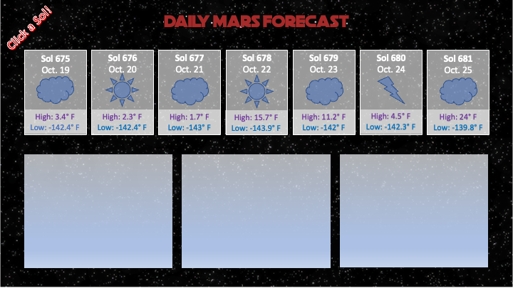

# Mars Report!

## Deployed @ https://its-jefe.github.io/Mars-Report


## Overview
Get the weather on Mars! You pick the date.

## User Story
```
AS a user 

I WANT to access Mars' weather data in conjunction with images that correlate to those specific dates.

THEN I can put in a date (or choose a date) and get images
```

## Our APIs
https://api.nasa.gov/
* Insight: Mars Weather Service API
  
* Mars Rover Photos: Image data gathered by NASA's Curiosity, Opportunity, and Spirit rovers on Mars
  
* Tailwind CSS


## Our wireframe 



### if we have more time
```
Include a location of the rover 
```
